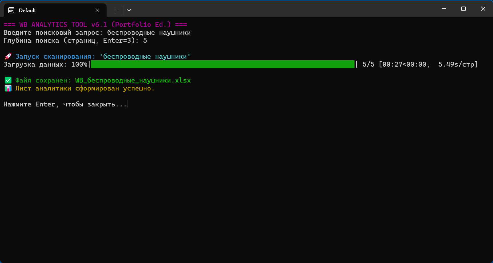
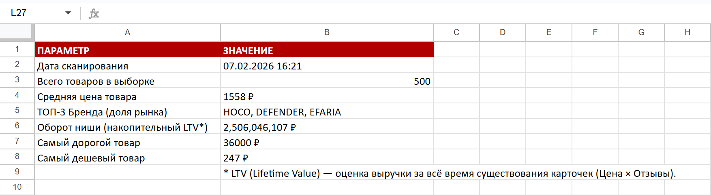
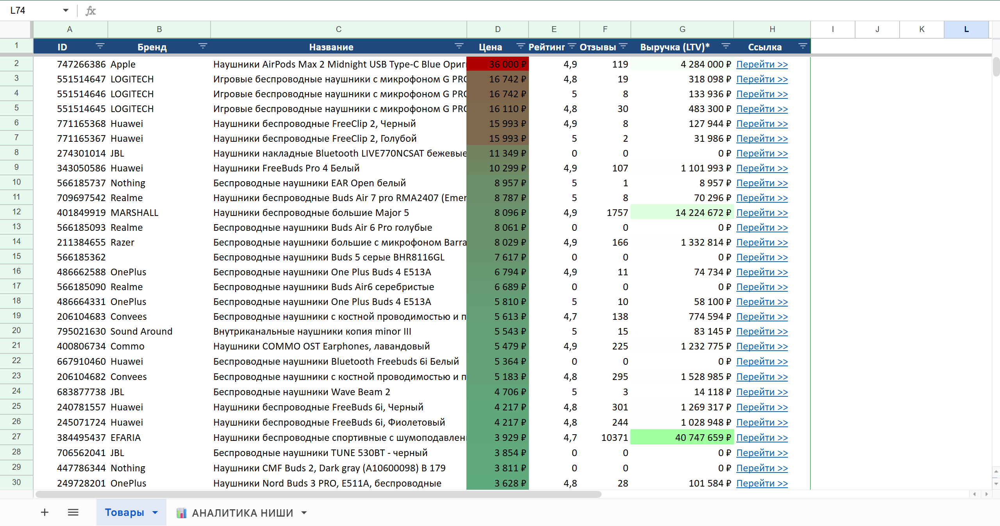
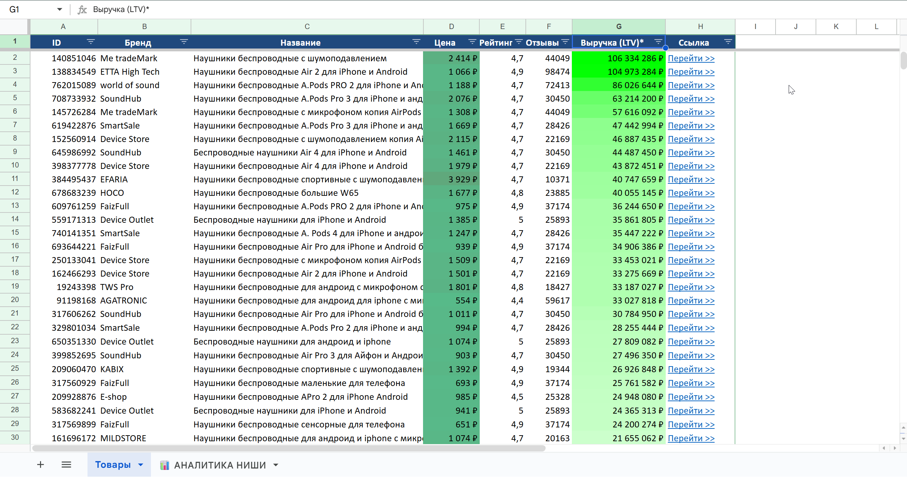

<h1 align="center">🛍️ Wildberries Analytics PRO</h1>

<p align="center"> 
   
   
   
</p>

## 📋 О проекте
Десктопный инструмент для мгновенного парсинга и глубокой аналитики ниш на Wildberries. 

Программа решает главную боль селлеров и менеджеров маркетплейсов: **«Как быстро оценить конкурентов, объем рынка и тренды, не прокликивая десятки страниц вручную?»**.

В отличие от стандартных парсеров на Selenium, данный скрипт работает напрямую через **внутреннее Mobile API** платформы, что обеспечивает колоссальную скорость сбора данных без нагрузки на систему.

## ✨ Ключевые возможности
- 🚀 **Сверхскорость:** Сбор до 500 товаров занимает всего 3-5 секунд.
- 🛡️ **Stealth Mode:** Встроена система имитации реального пользователя (подмена Headers, Cookies и QueryID) для обхода защиты Cloudflare.
- 💰 **Метрика LTV (Lifetime Value):** Скрипт не просто собирает цены, но и оценивает историческую выручку каждой карточки (`Цена × Кол-во отзывов`).
- 📊 **Smart Dashboard:** Автоматическая генерация второго листа в Excel со сводной аналитикой (средний чек, емкость рынка, ТОП-3 бренда ниши).
- 🎨 **Готовый отчет:** На выходе формируется стилизованный `.xlsx` файл с авто-фильтрами, денежными форматами и кликабельными ссылками.

## 📸 Скриншоты работы

**1. Процесс сбора данных (CLI):**


**2. Дашборд аналитики (Сводка по нише):**


**3. Умная таблица с результатами:**



## 🛠 Технический стек
- **Язык:** `Python 3.10`
- **Сетевые запросы:** `requests`
- **Анализ данных:** `pandas`
- **Форматирование отчетов:** `openpyxl`
- **Интерфейс:** `colorama`, `tqdm`

## ⚙️ Установка и запуск (Для разработчиков)

1. Склонируйте репозиторий:
   ```bash
   git clone https://github.com/ВАШ_НИК/WB_Analytics_Tool.git
   ```
2. Установите зависимости:
   ```bash
   pip install -r requirements.txt
   ```
3. Добавьте свои данные авторизации в файл скрипта (`src/wb_parser.py`):
   - `x-queryid`
   - `Cookie`
   
   *(Данные можно получить в DevTools браузера во вкладке Network при поиске любого товара на WB).*
4. Запустите скрипт:
   ```bash
   python src/wb_parser.py
   ```

> ⚠️ **Отказ от ответственности:** Данный код предоставлен исключительно в образовательных целях. Использование скрипта для создания чрезмерной нагрузки на серверы Wildberries запрещено.

---

## 💼 Для заказчиков (Услуги сбора данных)
Поскольку алгоритмы защиты маркетплейса регулярно обновляются и требуют актуальных сессионных данных (Cookies), программа публикуется в формате открытого исходного кода для разработчиков. 

**Если вам нужны данные для анализа, но вы не хотите разбираться в коде:**
Я предоставляю услуги профессионального сбора данных (Web Scraping). Вы получите готовый, чистый Excel-файл с настроенным дашбордом по вашей нише (как на скриншотах выше) без необходимости что-либо устанавливать. 

Возможна доработка логики скрипта под ваши бизнес-задачи:
- Добавление новых метрик;
- Парсинг определенных категорий;
- Интеграция отчетов в Telegram-ботов.

Открыт к сотрудничеству!
